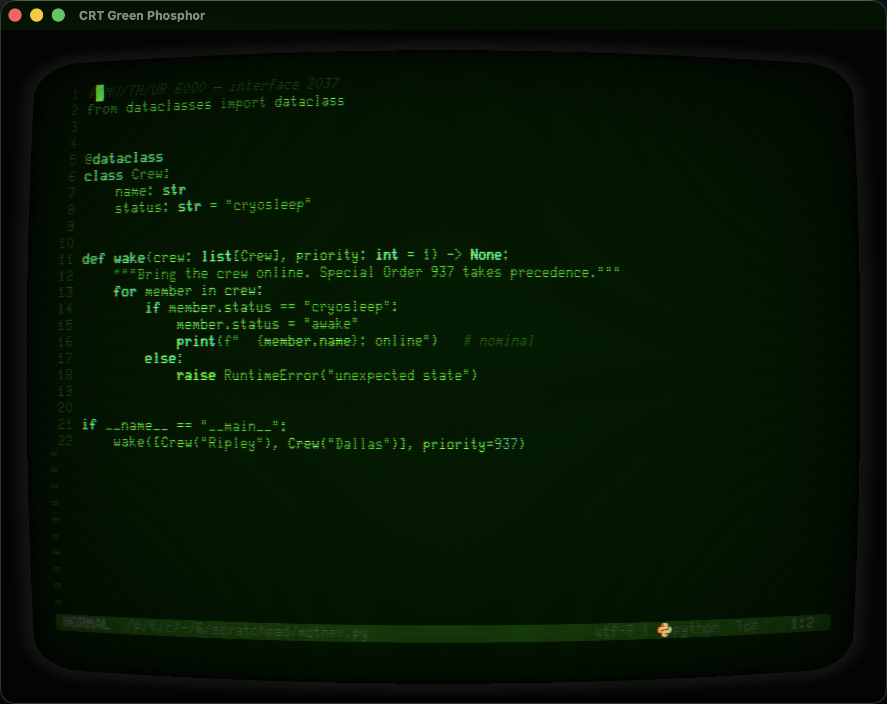

# Ghostty — quickstart runbook

Everything operational for the Ghostty side of retro-terminals: build the
profiles, browse/tune/publish in the studio, and opt into theme-following tmux.
(The iTerm2 side lives in the main [README](README.md).)

Everything is single-sourced from `build_profiles.py` — the same 39 palettes the
iTerm2 profiles use. Edit a color once, rebuild, both backends agree.

> Paths in this doc use `/path/to/retro-terminals` — substitute wherever you
> cloned this repo.

---

## 1. One-time setup

```bash
brew install --cask ghostty          # if you don't have it yet
python3 build_ghostty.py             # write themes + configs + shader into ~/.config/ghostty
./fonts/install-fonts.sh             # the retro fonts (Glass TTY VT220, C64 Pro Mono, …)
```

`build_ghostty.py` writes into `~/.config/ghostty/`:

| Path | What it is |
|---|---|
| `themes/<slug>` | colors only — `theme = <slug>` or `ghostty +list-themes` |
| `retro/<slug>` | full self-contained config (colors + font + window + CRT shader) |
| `shaders/crt.glsl` | the shared CRT shader (the 17 tube profiles reference it) |
| `retro/aliases.sh` | a `ghostty-<name>` launcher per profile, plus `ghostty-random` (macOS + Linux) |

Flags: `python3 build_ghostty.py --stdout` previews one config without writing;
`--dest DIR` writes somewhere else; `--no-titles` skips pinning the machine name
in the window/tab title.

By default each config sets `title = <machine name>`, so the window/tab shows
which profile it is (handy with several tubes open). It's *static* — it replaces
the dynamic dir/command title; pass `--no-titles` if you'd rather keep that. The
iTerm2 side does the same via `build_profiles.py` (a "Profile Name" title
component, which the shell can't override); `--no-titles` there too.

---

## 2. Wear a machine

Ghostty has **no profile picker** — one window = one look, chosen at launch.
Three ways to choose:

**a. Launch a window as a machine** (the everyday path):

```bash
source ~/.config/ghostty/retro/aliases.sh   # once (or add to ~/.zshrc)
ghostty-hal-9000     # a specific machine — ghostty-tron, ghostty-crt-amber-phosphor, …
ghostty-random       # roll the dice: a random machine, full font + CRT
```

Each opens a **new Ghostty instance** wearing that machine (colors + font + CRT
shader + title) and **boots** it — banner, period prompt, ENTER gate. See §3 for
the boot screen and the one-instance-per-machine model.

**b. Make one your everyday default** — create `~/.config/ghostty/config`:

```
config-file = retro/sci-fi-the-matrix
```

Every new window (⌘N) now wears it. Change the line + ⌘⇧, to switch.

**c. Recolor all open windows live** (palette only, no font/shader) — in that
same config:

```
theme = corp-mu-th-ur-6000-crt
```

then reload with **⌘⇧,**.

> `theme =` brings just the 16 colors and applies live everywhere on reload.
> `config-file = retro/<slug>` brings the whole machine (font + shader too).

---

## 3. The boot screen and the launch model

`ghostty-<machine>` and `ghostty-random` don't just recolor — they **boot** the
window like a period machine: the ASCII banner, a gallery-style spec line
(`Sci-Fi · HAL 9000 · 2001`), the era-correct prompt (`HAL>`), then it **holds
for you to press ENTER** before dropping to the shell. That pause is the point —
the startup screen no longer flashes past.

The prompt and banner are driven by the shell side; wire it once:

```bash
# ~/.zshrc (or a machine-local ~/.zshrc.local sourced BEFORE your tmux autostart,
# so the boot lands inside the first tmux pane instead of being wiped by it)
source /path/to/retro-terminals/retro-prompts.zsh
source ~/.config/ghostty/retro/aliases.sh
```

| Toggle | Effect |
|---|---|
| `RETRO_BOOT_WAIT=0` | skip the ENTER gate — straight to the prompt |
| `RETRO_BANNER_DIR=DIR` | where paste-your-own banners live (default `~/.config/retro-terminals/banners`) |

**Paste your own art.** Drop a file named for the machine
(`~/.config/retro-terminals/banners/hal`, or `hal.txt`) and it prints verbatim,
winning over the built-in — embed ANSI color, or leave it plain to ride the
machine's native palette. Nine machines ship built-in banners (`hal weyland vk
nostromo tron wopr lcars pipboy c64`); `tools/retro-banner --list` shows them and
the override path.

### One instance per machine — and why

macOS binds a Ghostty **config to the process** and can't open a new window with
a *different* config inside a running instance (the `+new-window` IPC is
Linux-only; on macOS Ghostty points you at `open -na Ghostty`). So each launcher
uses `open -n` — a **new instance** — the only way `--config-file` takes effect.
One instance = one machine.

That's the model, not a tax:

- **More windows of the same machine** — inside a machine's window, **⌘N / ⌘T**
  open more windows/tabs of *that* machine, no new instance. Each inherits
  `env = RETRO_MACHINE=<key>` (baked into the config) and quietly wears the
  period prompt — without re-running the banner + gate.
- **A different machine** — run another `ghostty-<machine>` / `ghostty-random`.
  That's the only time you spawn a new instance.

So: launch a machine once, live in it with ⌘N/⌘T; spawn a new instance only to
change machines. The theatrical boot fires on the fresh launch; sibling windows
just wear the prompt.

> Why not one instance recoloring per window? OSC escapes can repaint the 16
> colors live but **can't change the font or shader** — only a real config load
> does, which is why the launch model is per-instance. The `retro <machine>` /
> `retro random` shell commands still do that live OSC recolor when you want it
> (e.g. inside iTerm2, where the profile is fixed). `retro off` restores.

---

## 4. Browse, tune, publish — the studio

```bash
python3 build_ghostty.py --studio    # build ghostty-studio.html from the SPEC
open ghostty-studio.html
```

- **Browse** — click any of the 39 machines for a live preview in its real font
  and palette.
- **Tune** — drag the nine CRT dials (curvature, scanlines, grille, aberration,
  bloom, flicker, brightness, bezel, corner) + a **screen padding** dial. The
  preview runs the same math Ghostty does, so it's a true preview.
- **CRT toggle** — put the shader on any profile, tube or not.
- **Publish** — hit **Copy publish command**, paste it in a terminal. It writes
  the profile **and opens a window wearing it** (a running window keeps its
  launch look — publishing hands you a fresh one).

The CRT dials tune the *shared* `shaders/crt.glsl` (one shader, all tubes);
**screen padding** is per-profile and rewrites that profile's `window-padding`.

---

## 5. Tune the CRT by hand

The knobs are the constants at the top of the shader:

```glsl
const float CURVATURE  = 4.0;    // lower = more bulge
const float SCANLINE   = 0.15;
const float BLOOM      = 0.06;
const float BRIGHTNESS = 1.35;   // offsets scanline dimming
const float BEZEL      = 0.06;   // gap from the window edge
const float CORNER     = 0.10;   // rounded tube glass
```

Two copies exist — mind which you edit:

| File | Use | Survives rebuild? |
|---|---|---|
| `shaders/crt.glsl` (this repo) | durable changes → `python3 build_ghostty.py` to deploy | ✅ source of truth |
| `~/.config/ghostty/shaders/crt.glsl` | quick experiment → ⌘⇧, to apply | ❌ overwritten on next build |

Put `custom-shader = /Users/<you>/.config/ghostty/shaders/crt.glsl` in your main
`~/.config/ghostty/config` to give **every** window the tube, tube or not.

---

## 6. Opt into theme-following tmux

The status bar, window tabs, pane borders, copy mode and clock can all follow
whichever profile the window wears — because they're built from ANSI palette
slots 0–15, which each retro profile redefines. Source the drop-in **after**
your own status block.

On a multi-machine setup, use a non-synced machine-local include so it stays on
this box only (many configs already source `~/.tmux.conf.local` at the end):

```bash
# ~/.tmux.conf.local
source-file /path/to/retro-terminals/integration/tmux-retro-status.conf
```

Apply it now, and revert any time:

```bash
tmux source-file ~/.tmux.conf        # apply
# delete the source-file line to revert — nothing here is destructive
```

Starship already follows (it styles with ANSI color *names* like `green` /
`cyan`, which map to slots). Only tmux needed teaching.

---

## 7. Opt into theme-following nvim

nvim with `termguicolors` bakes 24-bit hex and ignores the ANSI palette — so it
doesn't follow the profile the way tmux/starship do. `integration/nvim` is a
tiny plugin: a `retro-ansi` colorscheme (turns `termguicolors` off, draws from
cterm slots 0–15) plus a **`:Retro`** command. The editor then wears whichever
profile the window has (green tube → monochrome-green nvim; C64 → C64).

Install — with **lazy.nvim**, add a local `dir` spec:

```lua
{ dir = vim.fn.expand("/path/to/retro-terminals/integration/nvim"),
  name = "retro-ansi", lazy = false, priority = 900 }
```

or **without a plugin manager**, put the dir on the runtimepath and source the
command:

```lua
local d = vim.fn.expand("/path/to/retro-terminals/integration/nvim")
vim.opt.rtp:append(d)                     -- expose colors/retro-ansi.lua
vim.cmd.source(d .. "/plugin/retro.lua")  -- define :Retro
```

Then **`:Retro`** in a retro window. It saves your current colorscheme +
`termguicolors`, switches to `retro-ansi` (16-color mode so it can follow the
palette), and `:Retro` again restores exactly what you had — no scheme name is
hardcoded, so it fits any daily driver. (`:colorscheme retro-ansi` also works if
you just want to set it directly.)

## 8. After editing palettes

```bash
python3 build_profiles.py            # rebuild iTerm2 profiles
python3 build_ghostty.py             # rebuild Ghostty configs + shader
python3 build_ghostty.py --studio    # refresh the studio page
```

Both backends stay in lockstep because they compile the same `build_profiles.py`
SPEC — `build_ghostty.py` imports it rather than copying it.

---

## Troubleshooting

**Mouse scroll dead in a full-screen app outside tmux** (mdbrowse, fzf, htop…).
Ghostty sets `TERM=xterm-ghostty`; if that terminfo entry isn't installed, apps
that probe terminfo before enabling mouse reporting come up empty and never turn
the mouse on — so the wheel does nothing. tmux masks it (`tmux-256color` is
always installed and mouse-capable); pagers like `less`/`man` still scroll
because Ghostty fakes wheel→arrow-keys for them, which doesn't consult terminfo.

Install Ghostty's bundled terminfo for your user (no sudo):

```bash
B=/Applications/Ghostty.app/Contents/Resources/terminfo
mkdir -p ~/.terminfo/78 ~/.terminfo/67
cp "$B/78/xterm-ghostty" ~/.terminfo/78/
cp "$B/67/ghostty"       ~/.terminfo/67/
infocmp xterm-ghostty >/dev/null && echo installed    # verify: should print `installed`
```

Then just re-run the app — no new window needed. (Self-updating alternative:
`export TERMINFO_DIRS="$B:"` in your shell rc, which tracks Ghostty updates but
only covers shell-launched apps.)

---

## nvim, wearing the machine



`:Retro` in a green-phosphor window (§7) — nvim drops to 16-color mode and draws
its syntax highlighting from the terminal's ANSI palette, so the editor goes
monochrome phosphor green, curved glass, scanlines, and all. The same file in a
C64 or amber window would wear that machine's palette instead. Terminal, status
bar, prompt, and editor, one tube.
