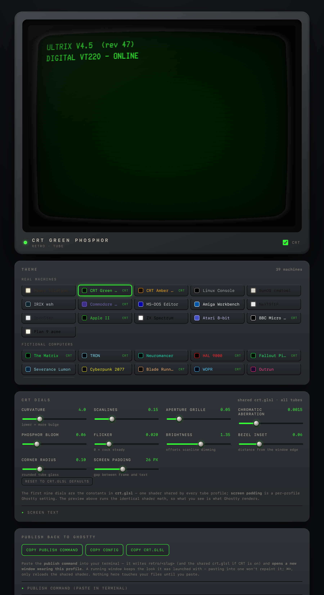

# Retro Terminals — iTerm2 profiles (and a Ghostty CRT port)

**39 terminal palettes** in four groups — real historic machines (`retro`),
fictional computers (`sci-fi`), aesthetic movements (`aesthetic`), and the
Alien/Blade Runner megacorps (`corp`) — generated from one declarative palette
spec. That single spec compiles to **two backends**:

- **iTerm2** (`build_profiles.py`) — the daily driver. 39 Dynamic Profiles,
  boot banners, matching prompts, and a static scanline bezel. Unlimited
  scrollback and session logging. The CRT look is *faked* (blur + bright bold).
- **Ghostty** (`build_ghostty.py`) — the same 39 palettes as Ghostty themes and
  configs, plus a **real GPU CRT shader** (curvature, scanlines, chromatic
  aberration, bloom) on the 17 "tube" machines. The effect iTerm2 can't do.

The palettes live in `build_profiles.py`; Ghostty's builder **imports** that
spec rather than copying it, so the two backends never drift. Edit a hex value
once, rebuild both.

### ▶ Live demo

**[Profile gallery](https://giantravens.github.io/retro-terminals/)** ·
**[CRT playground](https://giantravens.github.io/retro-terminals/crt-playground.html)** ·
**[Ghostty Studio](https://giantravens.github.io/retro-terminals/ghostty-studio.html)**

The gallery renders every profile in its real font (the OFL/public-domain fonts
are embedded, so they show for everyone; the rest need a local install). The
playground is a live WebGL curved-glass CRT. The **studio** browses all 39
palettes, tunes the CRT live, and publishes a ready-to-use Ghostty profile.

[](https://giantravens.github.io/retro-terminals/ghostty-studio.html)

## Install (build them into your iTerm2)

```bash
./install.sh              # fetch fonts + build all profiles into iTerm2
./install.sh --no-fonts   # profiles only (fonts already present)
```

Under the hood the profiles are built by one script:

```bash
python3 build_profiles.py
```

It writes four JSON files into `~/Library/Application Support/iTerm2/DynamicProfiles/`,
which iTerm2 **watches and hot-loads live** — no restart. Re-run it any time you
edit a palette; open tabs restyle within a second. Then in iTerm2 press **⌘O** and
filter by tag (`retro` / `sci-fi` / `aesthetic` / `corp`).

## What's installed — `retro` (real machines)

| Profile | Look | Font |
|---|---|---|
| Paper Teletype | Sepia ink on aged fanfold paper (DECwriter / ASR-33) | Courier |
| CRT Green Phosphor | P1 green monochrome, glow via blur + bright bold | Glass TTY VT220 |
| CRT Amber Phosphor | P3 amber monochrome | Glass TTY VT220 |
| Linux Console | Boot-to-tty1, VGA 16-color palette | Terminus (TTF) |
| SunOS cmdtool | Black-on-beige OpenWindows workstation | Courier |
| IRIX wsh | Deep-teal SGI console, signature SGI blue | Menlo |
| Commodore 64 | Light-blue-on-blue PETSCII, Pepto palette | C64 Pro Mono |
| MS-DOS Editor | Blue-screen edit.com / QBasic | IBM 3270 |
| Amiga Workbench | Workbench 1.3 blue / white / black / orange | Departure Mono |
| NeXTSTEP | Refined neutral-grey greyscale (1989 Terminal) | Menlo |
| OpenStep | NeXTSTEP's 1996 near-twin — cooler, lighter grey | Menlo |
| Apple II | Crisp green Applesoft (deliberately un-glowy) | Print Char 21 |
| ZX Spectrum | Black ink on white paper, ULA primaries | Departure Mono \* |
| Atari 8-bit | Cyan-blue READY screen with gold accent | Departure Mono \* |
| BBC Micro Mode 7 | Teletext pure-primary palette | Bedstead |
| Plan 9 acme | Bell Labs pale-yellow paper (`#FFFFEA`) | Menlo |

\* ZX Spectrum and Atari fall back to Departure Mono — their authentic fonts aren't
freely hosted. The palette does the identifying work.

## `sci-fi` (fictional computers)

| Profile | Look |
|---|---|
| The Matrix | Digital-rain green `#00FF41`, glow |
| TRON | ENCOM grid cyan + orange villain accent |
| Neuromancer | Ono-Sendai cyberspace: cyan + magenta neon |
| HAL 9000 | Red monochrome, ominous |
| Fallout Pip-Boy | RobCo Termlink green, heavy scanlines |
| Severance Lumon | Teal on navy, corporate-creepy |
| Cyberpunk 2077 | Night City yellow + cyan |
| Blade Runner | Esper amber + teal, smoky |
| WOPR | NORAD radar blue — *shall we play a game?* |
| Outrun | Synthwave hot-pink + cyan on deep purple |
| LCARS | Star Trek panel palette — orange / gold / mauve / blue on black |

## `aesthetic` (genre movements)

| Profile | Look |
|---|---|
| Steampunk | Brass, copper, verdigris on aged mahogany |
| Solarpunk | Warm cream, leaf-green + gold (light) |
| Dieselpunk | Machine-age teal, rust, cream |
| Vaporwave | Pastel pink / cyan / lilac on purple |
| Atompunk | Mid-century cream, atomic-coral + turquoise (light) |

## `corp` (Alien + Blade Runner megacorps)

The two franchises share a universe (Weyland → Tyrell), so they share a pack.
Spread across distinct hues so they don't all read as "amber sci-fi":

| Profile | Look |
|---|---|
| Weyland-Yutani | The Company — amber-gold CRT with green data accents |
| MU-TH-UR 6000 | The Nostromo's MOTHER, stylized teal-green |
| MU-TH-UR 6000 CRT | Screen-accurate MOTHER — bright P1 phosphor green (*interface 2037, ready for inquiry*) |
| Seegson APOLLO | Sevastopol's budget AI — cold blue-white, red working light |
| Tyrell Corporation | Opulent candle-gold + deep red (*more human than human*) |
| Wallace Corporation | 2049 brutalist cold teal with one warm accent |
| Voight-Kampff | Clinical tungsten-orange empathy-test instrument |

All three notional packs get boot banners too, and matching `retro` prompts
(`retro matrix`, `retro hal`, `retro weyland`, `retro tyrell`, `retro vk`, …).

## Visual gallery & CRT playground

Hosted on GitHub Pages (public, shareable):

- **Gallery** — every profile rendered in its real font:
  <https://giantravens.github.io/retro-terminals/>
- **CRT playground** — a WebGL curved-glass shader (the effect iTerm can't do
  natively): <https://giantravens.github.io/retro-terminals/crt-playground.html>

The gallery links to the playground and explains how the five parts (profiles,
banners, prompts, bezel, playground) fit together. The four OFL/public-domain
fonts (Terminus, IBM 3270, Departure Mono, Bedstead) are **embedded as base64**
(`tools/embed-fonts.py`), so those cards render for any visitor. Glass TTY VT220,
C64 Pro Mono and the Apple/Kreative faces aren't bundled (redistribution terms) —
those cards fall back to monospace unless you `./fonts/install-fonts.sh` locally.

## How it works

`build_profiles.py` holds a compact `PROFILES` spec — each machine is a set of
`#RRGGBB` hex colors plus a few settings (font, cursor, blink, glow). The script
compiles that into iTerm2's verbose float-based JSON and writes it to:

```
~/Library/Application Support/iTerm2/DynamicProfiles/retro-terminals.json
```

iTerm2 **watches that folder and hot-loads changes live** — no restart, no
manual import. The profiles appear in the profile switcher (`⌘⇧O`) tagged
`retro`.

GUIDs are derived deterministically from each profile name (`uuid5`), so
re-running the script **updates profiles in place** instead of creating
duplicates. Never hand-edit a `Guid`; in iTerm2 it's the profile's identity.

## Using a profile

- Browse: **Profiles** menu, or `⌘⇧O` and filter by `retro`.
- New tab in a profile: **Profiles ▸ Retro · …**.
- Make one your default: iTerm2 ▸ Settings ▸ Profiles ▸ select ▸ **Other Actions ▸ Set as Default**.

## Tweaking

Edit the hex values in `build_profiles.py`, then:

```bash
python3 build_profiles.py
```

The open tabs restyle within a second. Useful knobs per machine:

- `cursor_type`: `UNDERLINE` / `VBAR` / `BOX`
- `blink`: blinking cursor
- `aa`: anti-aliasing — **False** keeps bitmap fonts (C64, Terminus, Glass TTY,
  3270, Departure) crisp; **True** for outline fonts (Courier, Menlo)
- `transparency`, `blur`, `blur_radius`: the CRT glow approximation
- `min_contrast`: floor on text/background contrast (bump for readability)
- `vspacing` / `hspacing`: line/char spacing (a hair of `vspacing` fakes scanline gaps)

### Want "pure" vs "daily" variants?

Duplicate a `machine(...)` block, rename it (e.g. `"Commodore 64 (daily)"`), and
raise `min_contrast` / drop `transparency` + `blur`. The distinct name gives it
its own GUID automatically.

## Boot banners

Every profile prints its authentic startup screen when a **new tab** opens
(existing tabs won't re-run it) — the C64's `READY.`, the Amiga's `AmigaDOS`,
SunOS's release banner, and so on. It's the profile's `Initial Text`: one safe
`clear; printf …` command, after which you get a normal shell.

## Matching prompts — the `retro` command

Because this box runs **tmux + starship**, a prompt set at profile-open gets
overwritten by starship's `precmd` hook, and `ITERM_PROFILE` is stale inside
tmux. So prompts are a command you run, not per-profile magic:

```bash
source /path/to/retro-terminals/retro-prompts.zsh   # once (or add to ~/.zshrc)
retro c64      # READY.        retro amiga   # 1>
retro dos      # C:\>          retro irix    # indy 1%
retro apple2   # ]             retro off     # back to starship
retro          # list them
```

`retro` removes starship's hook while active and restores it on `retro off`, so
it works in any shell, in or out of tmux.

## Scanline bezel (real iTerm2)

The five "tube" profiles — Green, Amber, Apple II, C64, BBC — carry
`crt-bezel.png`, a mostly-transparent scanline + vignette overlay drawn behind
the text. Tune its strength per profile with **Settings ▸ Profiles ▸ Window ▸
Background image ▸ Blend** (the generator sets `Blend` to `0.45`). Regenerate the
overlay itself with ImageMagick if you want it heavier/finer — the two `magick`
lines are in the project history. This nudges real iTerm toward the browser
playground's look; it's texture, not the full curved-glass shader.

## Ghostty — the real CRT shader

> **Runbook:** [`GHOSTTY.md`](GHOSTTY.md) — build, launch, tune, publish, and the
> tmux opt-in, command-first in one place.

iTerm2 has no shader pipeline, so its "CRT" is the bezel PNG plus blur. Ghostty
renders on the GPU and takes a **custom GLSL shader**, so the same palettes get
actual curved glass. `build_ghostty.py` imports the `PROFILES` spec from
`build_profiles.py` and compiles it into `~/.config/ghostty/`:

```bash
python3 build_ghostty.py            # write into ~/.config/ghostty
python3 build_ghostty.py --stdout   # preview one config, write nothing
python3 build_ghostty.py --dest DIR # write somewhere else
```

It emits:

- `themes/<slug>` — colors only. Drop into an existing setup with
  `theme = <slug>` in your config, or browse with `ghostty +list-themes`.
- `retro/<slug>` — a fully self-contained config (colors + font + window +
  shader). Launch a styled window:
  `ghostty --config-file=~/.config/ghostty/retro/<slug>`.
- `shaders/crt.glsl` — the CRT fragment shader (`shaders/crt.glsl` in this
  repo), attached to the same 17 "tube" machines that got the iTerm2 bezel.
- `retro/aliases.sh` — a `ghostty-<name>` launcher per profile (macOS
  `open -na Ghostty …`). `source` it from your `~/.zshrc`.

```bash
brew install --cask ghostty        # if you don't have it yet
source ~/.config/ghostty/retro/aliases.sh
ghostty-mu-th-ur-6000-crt          # MOTHER, on curved glass
```

Tweak the shader constants (`CURVATURE`, `SCANLINE`, `BLOOM`, `FLICKER`, …) at
the top of `shaders/crt.glsl` — Ghostty hot-reloads shaders when the window
regains focus.

**Mapping caveats** (where the two backends can't be identical):

- Transparency is inverted (iTerm2 `0` = opaque; Ghostty `background-opacity 1`
  = opaque) — the builder handles it.
- iTerm2's blur *radius* has no Ghostty analog → `background-blur = true`.
- Bitmap/pixel fonts render soft: Ghostty has no "anti-aliasing off" toggle, so
  C64 / Terminus / Glass TTY / 3270 / Departure lose the crisp-pixel look.
- Boot banners, matching prompts, Minimum Contrast, Bright-Bold, Link Color:
  no clean Ghostty equivalent → dropped. (Banners belong in your shell rc.)
- `bold-color` needs Ghostty ≥ 1.1; older builds log "unknown field" and skip it.

iTerm2 stays the recommended daily driver (scrollback + logging). Ghostty is the
"fun" terminal you open when you want the real tube.

## Ghostty Studio — browse, tune, publish

`ghostty-studio.html` is a self-contained page that closes the loop: **browse**
all 39 palettes, **tune** the CRT live, and **publish** the result straight back
into `~/.config/ghostty`.

```bash
python3 build_ghostty.py --studio    # regenerate the page from the SPEC
open ghostty-studio.html
```

- **Browse** — every machine, grouped by pack, with a live terminal preview in
  its real font and palette. Tube machines are tagged `CRT`.
- **Tune** — nine dials that *are* the constants in `shaders/crt.glsl`
  (curvature, scanlines, aperture grille, aberration, bloom, flicker,
  brightness, bezel inset, corner radius), plus a per-profile **screen padding**
  dial. The preview runs the identical WebGL math, so what you see is what
  Ghostty draws. Toggle **CRT** on any profile to preview/publish the shader.
- **Publish** — copy the **publish command** and paste it in your terminal. It
  writes `retro/<slug>` (and the shared `crt.glsl` if CRT is on) and **opens a
  new window wearing the profile**. A running window keeps the look it was
  launched with, so publishing hands you a fresh one rather than repainting it.
  Nothing is written until you paste — the browser can't touch your files, so
  the tool hands you a shell command instead.

Single-sourced like everything else: the page is filled from `build_profiles.py`
via `tools/studio-template.html`, so it never drifts from the palettes. Edit a
color, re-run `--studio`, reload the page. The CRT dials tune the *shared*
`crt.glsl` — one shader for all tubes — so publishing it updates every tube;
`screen padding` is per-profile and rewrites that profile's `window-padding`.

## Following the theme — starship, tmux, nvim

ANSI palette slots **0–15 follow the active profile; the 256-cube (16–255) and
`#hex` are fixed**. So anything drawn with a slot 0–15 (or an ANSI *name* like
`green`) re-colors automatically when you switch profiles — the same trick that
makes the whole palette swap live. A program can't know *which* named profile is
active, but it doesn't need to: draw from slots and it wears whatever the window
is using.

> Paths below use `/path/to/retro-terminals` — substitute wherever you cloned
> this repo.

- **Starship already follows.** `starship.toml` styles with `green` / `yellow`
  / `cyan` / `purple` — ANSI names → slots 2/3/6/5. Open any profile and the
  prompt is already wearing its colors. (Monochrome tubes render a monochrome
  prompt — authentic.)
- **tmux doesn't, by default.** The stock airline footer pins `colour236` /
  `colour31` / `colour214` (all ≥ 16, fixed), so it looks identical everywhere.
  `integration/tmux-retro-status.conf` redraws the whole tmux surface — status
  bar, window tabs, pane borders, copy mode and clock — from slots 0–15, so it
  tracks the profile. Enable by sourcing it *after* your own status block:

  ```bash
  source-file /path/to/retro-terminals/integration/tmux-retro-status.conf
  ```

  On a multi-machine setup, put that line in a non-synced machine-local include
  (many configs already source `~/.tmux.conf.local` at the end), then
  `tmux source-file ~/.tmux.conf`. Delete the line to revert. In Ghostty the
  same file works — the CRT shader tints the footer along with everything else.
- **nvim doesn't either** — modern colorschemes set `termguicolors` and bake
  24-bit hex, bypassing the ANSI palette entirely. `integration/nvim` is a tiny
  plugin — a `retro-ansi` colorscheme (turns `termguicolors` off, paints every
  highlight group from slots 0–15) plus a **`:Retro`** command. The editor then
  wears whichever profile the window has (green-phosphor window → monochrome-
  green nvim; C64 → C64). Point your runtimepath at it — with lazy.nvim:

  ```lua
  { dir = vim.fn.expand("/path/to/retro-terminals/integration/nvim"),
    name = "retro-ansi", lazy = false, priority = 900 }
  ```

  or without a plugin manager:

  ```lua
  local d = vim.fn.expand("/path/to/retro-terminals/integration/nvim")
  vim.opt.rtp:append(d)                     -- expose colors/retro-ansi.lua
  vim.cmd.source(d .. "/plugin/retro.lua")  -- define :Retro
  ```

  Then **`:Retro`** in a retro window: it saves your current scheme, switches to
  `retro-ansi` (16-color mode), and `:Retro` again restores exactly what you had.
  It's a mode you toggle into, since following the palette needs 16-color mode.

## Fonts & provenance

Installed to `~/Library/Fonts` (all free):

- **Glass TTY VT220** — Viacheslav Slavinsky, `sensi.org/~svo/glasstty` (free)
- **C64 Pro Mono** — Style, `style64.org` (free for personal use)
- **Print Char 21** — Kreative Korp, `kreativekorp.com` (Apple ][ system font, free)
- **Bedstead** — bjh21, `bjh21.me.uk/bedstead` (SAA5050 teletext, public domain)
- **Terminus (TTF)** — `brew install --cask font-terminus` (OFL)
- **IBM 3270** — `brew install --cask font-3270` (OFL)
- **Departure Mono** — `brew install --cask font-departure-mono` (OFL)
- **Courier / Menlo** — macOS system fonts

## Notes on fidelity

iTerm2 has no CRT-shader support, so the green/amber tubes approximate the glow
with transparency + Gaussian blur + a brighter bold color and a touch of extra
line spacing. It reads as "phosphor," not as a curved-glass emulator.

For the full curvature/scanline treatment you have two paths off iTerm2: the
**Ghostty port** in this repo (`build_ghostty.py`, real GLSL shader, keeps your
exact palettes) or a dedicated emulator like **cool-retro-term** (the whole app
*is* the CRT). The iTerm2 profiles stay real sessions you can actually work in;
Ghostty is where the tube gets genuinely curved.
